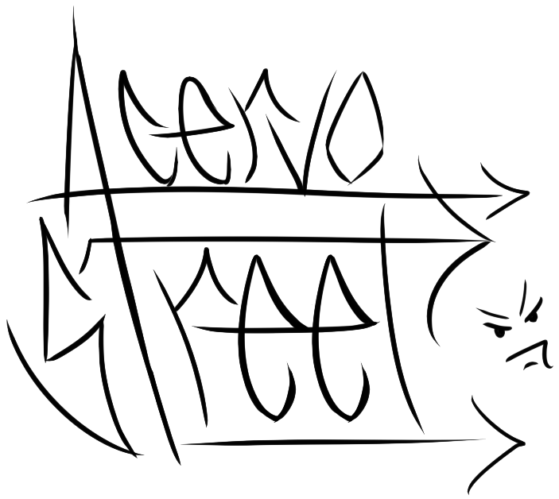

# 👔 Criação de loja virtual - Acervo Street

> Este repositório reúne estudos para criação de uma loja virtual de roupas, onde o foco é buscar conhecimento e aperfeiçoamento nas minhas habilidades de programação Front-End.

## 🚧 PROJETO EM ANDAMENTO 🚧

## 🧩 Introdução - O Projeto

Este projeto nasceu da iniciativa de criar um E-commerce focado na cultura Streetwear. Uma vitrine virtual para um público que busca a estética trapstar e ícones da cultura pop, aliando design moderno a uma experiência de compra acessível. 

O objetivo central foi aplicar conceitos estudados em Front-End, explorando novas estilizações e boas práticas de arquitetura de código.

## 👨‍💻 Tecnologias Utilizadas

Nesse projeto foi utilzado: 

- **HTML 5** 

- **CSS3** 

- **JavaScript** 


## 🔨 Funcionalidades

>O site conta com algumas funcionalidades interessantes, que o deixam mais completo e funcional para o dia a dia de um comprador.

### 💖 Sistema de curtidas:

````javascript
const botaoCurtir = document.querySelectorAll('.btn-curtir');

botaoCurtir.forEach((botao) => {
    botao.addEventListener('click', () => {
        botao.textContent = 'Curtido! ✅';
        botao.classList.toggle('curtido');
        botao.classList.contains('curtido') ? botao.textContent = 'Curtido! ✅' : botao.textContent = '❤️ Curtir';
    });  
    
}); 
````

Primeiro, eu declaro uma variável para receber a informação sempre que o botão, localizado no documento html, for clicado. 

Depois, eu crio um loop(`foreach`), o algoritmo processa a interação da seguinte forma: "Para cada vez que houver um "click", no botão, ele mudará a condição do botão para `'Curtido! ✅'`. Alterando também a classe declarada no estilo do botão. Por último, se o botão obter a classe `'curtido'` no css, ele manterá a condição de `'Curtido! ✅'`, se não, ele alterará a condição para, `'❤️ Curtir'`.

### 🧹 Filtro de busca inteligente

````javascript
const campoBusca = document.querySelector('#campo-busca');
const listaProdutos = document.querySelectorAll('.produto');

const limparTexto = (texto) => {
    return texto.toLowerCase().normalize("NFD").replace(/[\u0300-\u036f]/g, "");
};

campoBusca.addEventListener('input', () => {
    const valorBusca = limparTexto(campoBusca.value);

    listaProdutos.forEach(produto => {
        const nomeBruto = produto.querySelector('h2').textContent;
        const nomeLimpo = limparTexto(nomeBruto); 
        
        (nomeLimpo.includes(valorBusca)) ? produto.parentElement.style.display = "block" : produto.parentElement.style.display = "none";
    });
});
````
Um filtro de busca inteligente, onde detecta diversas variações de escrita de todos os produtos da loja.

## 🎨 Processo criativo

>Diferente de templates prontos, os elementos visuais deste projeto foram rascunhados e finalizados por mim, garantindo que a interface da Acervo Street tenha uma identidade única.

### 🐶 Mascote

<p align="center">


<p>


### 🖼️ Logo

<p align="center">

<p>

