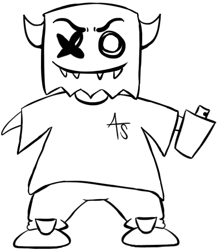
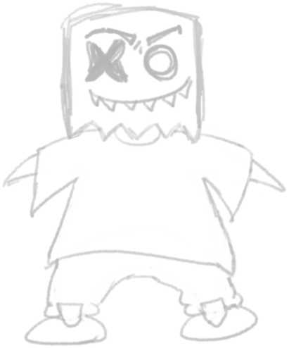
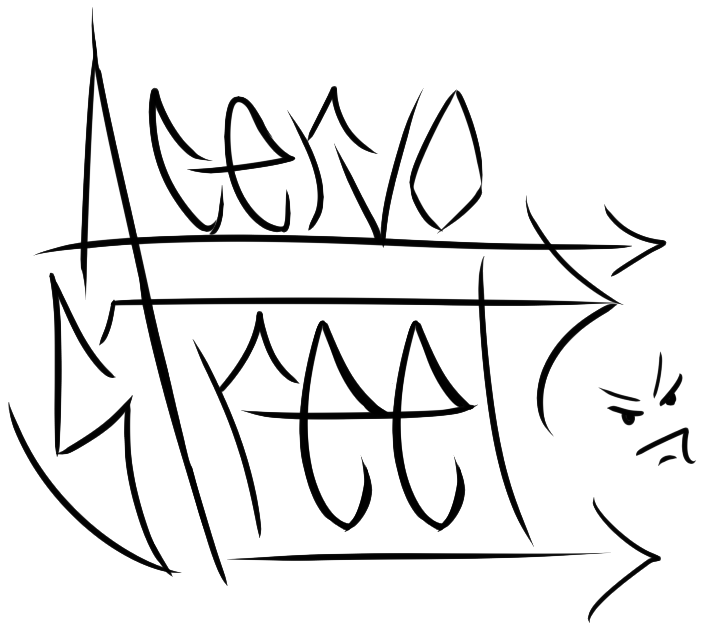

# 👔 Criação de loja virtual - Acervo Street

> Este repositório reúne estudos para criação de uma loja virtual de roupas, onde o foco é buscar conhecimento e aperfeiçoamento nas minhas habilidades de programação Front-End.

## 🚧 PROJETO EM ANDAMENTO 🚧

## 🧩 Introdução - O Projeto

Este projeto nasceu da iniciativa de criar um E-commerce focado na cultura Streetwear. Uma vitrine virtual para um público que busca a estética trapstar e ícones da cultura pop, aliando design moderno a uma experiência de compra acessível. 

O objetivo central foi aplicar conceitos estudados em Front-End, explorando novas estilizações e boas práticas de arquitetura de código.

## 👨‍💻 Tecnologias Utilizadas

Nesse projeto foi utilzado: 

- **HTML 5** 

- **CSS3** 

- **JavaScript** 


## 🔨 Funcionalidades

>O site conta com algumas funcionalidades interessantes, que o deixam mais completo e funcional para o dia a dia de um comprador.

### 🧹 Filtro de busca inteligente

````javascript
const campoBusca = document.querySelector('#campo-busca');
    const listaProdutos = document.querySelectorAll('.produto-card');

    const limparTexto = (texto) => {
        return texto.toLowerCase().normalize("NFD").replace(/[\u0300-\u036f]/g, ""); // Remove acentos e normaliza para comparação mais robusta(Expressão Regular)
    };

    if (campoBusca) {
        campoBusca.addEventListener('input', () => {
            const valorBusca = limparTexto(campoBusca.value);

            listaProdutos.forEach(produto => {
                const elementoTitulo = produto.querySelector('.titulo-produto');
                if (!elementoTitulo) return; 
                
                const nomeBruto = elementoTitulo.textContent;
                const nomeLimpo = limparTexto(nomeBruto); 
                
                produto.style.display = nomeLimpo.includes(valorBusca) ? "grid" : "none";
            });
        });
    }
````
Um filtro de busca inteligente, onde detecta diversas variações de escrita de todos os produtos da loja.

### 💖 Sistema de curtidas

````javascript
document.querySelectorAll('.btn-curtir').forEach(botao => {
        botao.addEventListener('click', function() {
            const produtoCard = this.closest('.produto-card');
            if (!produtoCard) return;
            
            const id = produtoCard.getAttribute('data-id');
            this.classList.toggle('curtido');

            // Lógica de salvar/remover do Local Storage
            let curtidos = JSON.parse(localStorage.getItem('produtosCurtidos')) || [];
            
            if (this.classList.contains('curtido')) {
                this.innerText = "❤"; // Preenchido
                if (!curtidos.includes(id)) curtidos.push(id);
            } else {
                this.innerText = "♡"; // Vazio
                curtidos = curtidos.filter(item => item !== id);
            }
            
            localStorage.setItem('produtosCurtidos', JSON.stringify(curtidos));
        });
    });
````

Implementação de um sistema de curtidas no Front-End com persistência de dados client-side. A lógica manipula o DOM para interatividade visual e utiliza `JSON.parse` e `JSON.stringify` para armazenar e recuperar o array de IDs dos produtos diretamente no Local Storage. Isso garante que o estado da aplicação seja mantido entre diferentes sessões do navegador.

### ⭐ Lista de Desejos & Side Drawer (Gaveta Lateral)

````javascript
function atualizarContadorHeader() {
    const curtidos = JSON.parse(localStorage.getItem('produtosCurtidos')) || [];
    const contador = document.getElementById('contador-curtidas');
    if (contador) {
        contador.innerText = curtidos.length;
    }
}
    atualizarContadorHeader();
(...)
     const toggleWishlist = () => {
        sidebarWishlist.classList.toggle('ativo');
        overlayWishlist.classList.toggle('ativo');
        // Só renderiza os itens se a gaveta estiver sendo aberta
        if (sidebarWishlist.classList.contains('ativo')) {
            renderizarWishlist();
        }
    };
(...)
    function renderizarWishlist() {
        const curtidos = JSON.parse(localStorage.getItem('produtosCurtidos')) || [];
        listaContainer.innerHTML = ''; // Limpa a lista antes de adicionar
(...)
        curtidos.forEach(id => {
            const produtoCard = document.querySelector(`.produto-card[data-id="${id}"]`);
            if (produtoCard) {
                const imgSrc = produtoCard.querySelector('img').src;
                const titulo = produtoCard.querySelector('.titulo-produto').textContent;
                const preco = produtoCard.querySelector('.preco-atual').textContent;
                const itemDiv = document.createElement('div');
                itemDiv.className = 'item-wishlist';
                itemDiv.innerHTML = `
                    
                    <div class="item-wishlist-info">
                        <h4>${titulo}</h4>
                        <p>${preco}</p></div>`;
                listaContainer.appendChild(itemDiv);
            }
        });
````
Implementei um sistema de Lista de Desejos (Wishlist) integrado ao cabeçalho do site. Em vez de um carrinho convencional, o usuário "curte" os achados de streetwear que deseja revisitar.

Esta funcionalidade demonstra conceitos avançados de Front-end, como:

- Manipulação Dinâmica do DOM.
- Data Binding Manual.
- Side Drawer UI (Gaveta Lateral).
- Persistência com Local Storage.

## 🎨 Processo criativo

>Diferente de templates prontos, os elementos visuais deste projeto foram rascunhados e finalizados por mim, garantindo que a interface da Acervo Street tenha uma identidade única.

### 🐶 Mascote

<p align="center">


<p>

### 🖼️ Logo

<p align="center">

<p>


## 🏆 Créditos

<p align="center">
Espero que você tenha curtido esse projeto, foi feito com muita dedicação e carinho :)
<br>Caso queira entrar em contato meu LinkedIn está logo abaixo ⬇<br><br>
  Desenvolvido por <b>Felipe Oliveira</b>
  <br><br>
  <a href="https://www.linkedin.com/in/felipe-oliveira-contato/">
    
  </a>
  <br><br>
  <bg>Vamos nos conectar!</bg>
</p>
